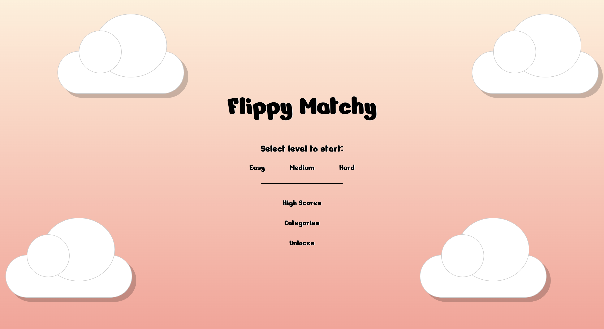
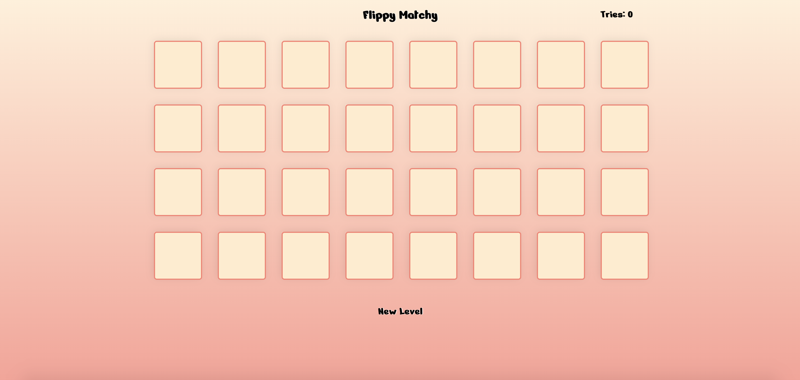
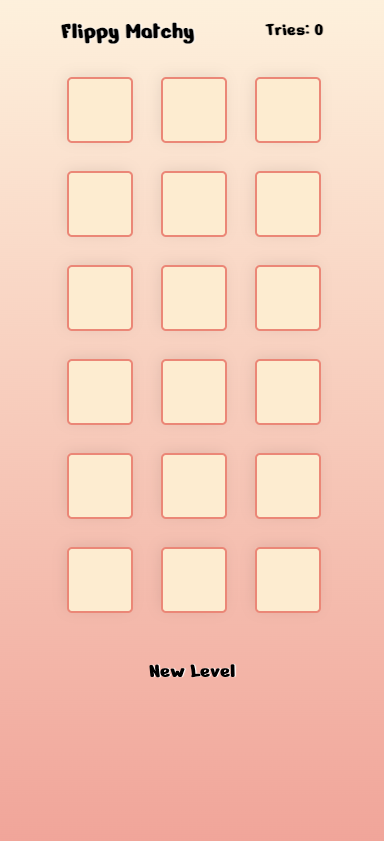
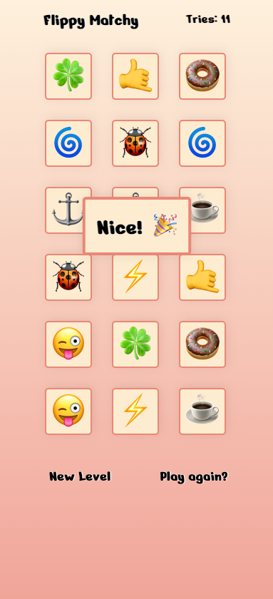
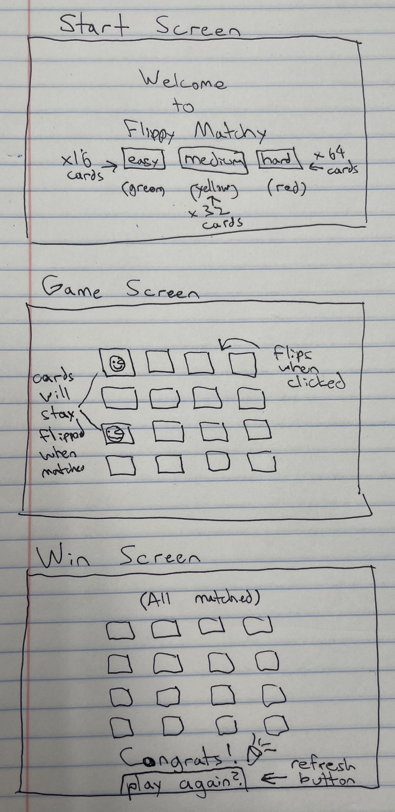

# Flippy Matchy

Play here: https://nickfasulo.github.io/flippy-matchy-game

Flippy Matchy is a match card game. To win you need to match each pair of identical cards in a deck. There are three levels to choose from: Easy, Medium, and Hard. The difference in levels are the amount of cards that are on the board.

Once a level is started, there is a brief moment where all of the cards are revealed - try to remember where the pairs are placed!

There is also a "Tries" counter that keeps track of the amount of failed attempts at matching two cards - try to keep this number as low as possible!

_Mobile friendly_

## Screenshots

## Wireframe

## Tech Used

HTML, CSS, Vanilla JavaScript

## Future Features

- Add countdown timer (user can set having timer on / off).
- Add selectable / unlockable categories for emojis used.
