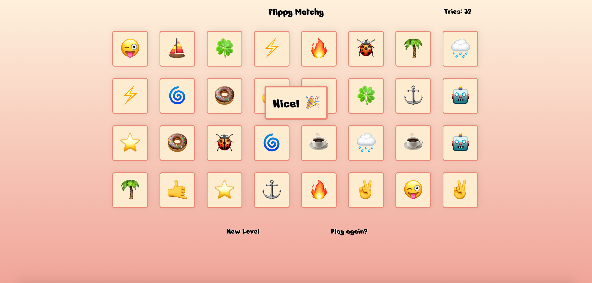

# Flippy Matchy

Play here: https://nickfasulo.github.io/flippy-matchy-game

Flippy Matchy is a match card game. To win you need to match each pair of identical cards in a deck. There are three levels to choose from: Easy, Medium, and Hard. The difference in levels are the amount of cards that are on the board.

Once a level is started, there is a brief moment where all of the cards are revealed - try to remember where the pairs are placed!

There is also a "Tries" counter that keeps track of the amount of failed attempts at matching two cards - try to keep this number as low as possible! There is an option to view your lowest number of tries for each level in the start menu.

Now introducing Combos! Match two or more pairs in a row and get a combo - what's the highest you can get? 

Finally, you can switch between emoji categories to play with - pick your favorite! Most categories are now locked until achieving certain milestones in game.

_Mobile friendly_

## Screenshots

## Wireframe

## Tech Used

HTML, CSS, Vanilla JavaScript

## Future Features

- Countdown timer (user can set having timer on / off).
- Limit number of unflips (the ability to flip a card back over before attempting to match with another card). Might include an increase to this amount every time a pair is matched.
- Add an info modal in the start menu.
